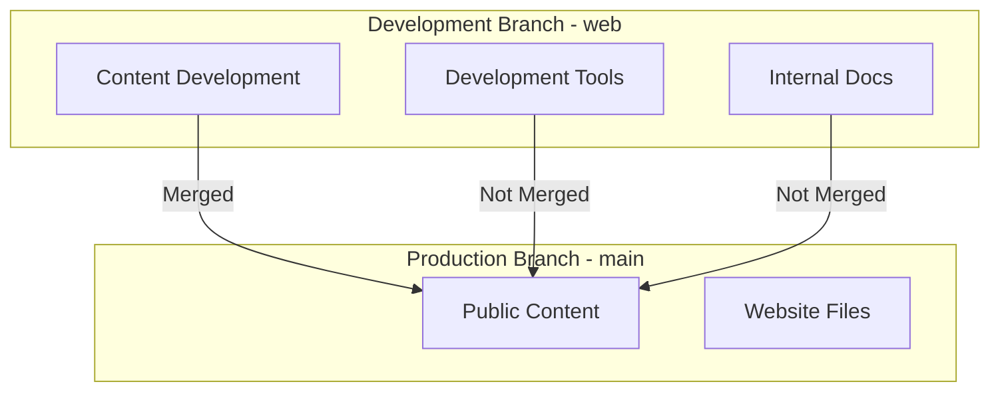

# AIRIE-TEACHING-DEV

## Repository Structure
- **web branch**: Development branch containing all content and development tools
- **main branch**: Public branch containing only the public-facing content
- **PENDING/Wisdom**: Documentation and reference materials for internal use
- **docs/**: Website files for GitHub Pages
  - **CNAME**: Custom domain configuration
  - **index.html**: Main entry point for the website
  - **learn/**: Learning resources and tutorials
    - Markdown files for easy content management
    - Automatically rendered by GitHub Pages
    - Organized by topic and difficulty level
- **utils/**: Development tools and automation scripts
  - Contains development-only tools (not merged to main)
  - Includes merge automation scripts
  - Development utilities

## Development Workflow

### Branch Structure

### Content Flow
1. **Development**:
   - All development happens in the `web` branch
   - Development tools stay in `web` branch
   - Content is organized in `docs/` directory

2. **Deployment**:
   - Content is merged from `web` to `main`
   - Development tools are excluded via `.gitignore`
   - Main branch contains only public content

3. **Automation**:
   - Merge process is automated via `utils/merge-to-main.sh`
   - Script remains in `web` branch only
   - Handles safe merging of content

## Learning Section Structure
The learning section is built using GitHub Pages' built-in Markdown rendering capabilities:

1. **Content Organization**:
   - All learning content lives in `docs/learn/`
   - Files are written in Markdown for easy editing
   - GitHub Pages automatically renders Markdown to HTML

2. **Navigation**:
   - Main page (`index.html`) links to learning resources
   - Direct links to individual learning pages
   - Easy to add new content by adding Markdown files

3. **Adding Content**:
   - Simply add new `.md` files to `docs/learn/`
   - Use standard Markdown formatting
   - Include proper headers and structure
   - GitHub Pages handles the rendering

4. **Best Practices**:
   - Keep filenames lowercase with hyphens
   - Use clear, descriptive names
   - Include proper Markdown headers
   - Add links in `index.html` for new content

## Development Tools
- **Merge Script**: Located in `utils/merge-to-main.sh`
  - Automates merging from `web` to `main`
  - Includes safety checks and validations
  - Stays in `web` branch only
  - Not merged to public content

## Environment Configuration
- `.env` file contains configuration for:
  - URLs and endpoints
  - Development paths
  - Not merged to public content

## Getting Started
1. Clone the repository
2. Switch to `web` branch for development
3. Make changes in `docs/` directory
4. Use merge script to deploy to `main`
5. GitHub Pages automatically deploys from `main`

---
*Last updated: March 2024*
