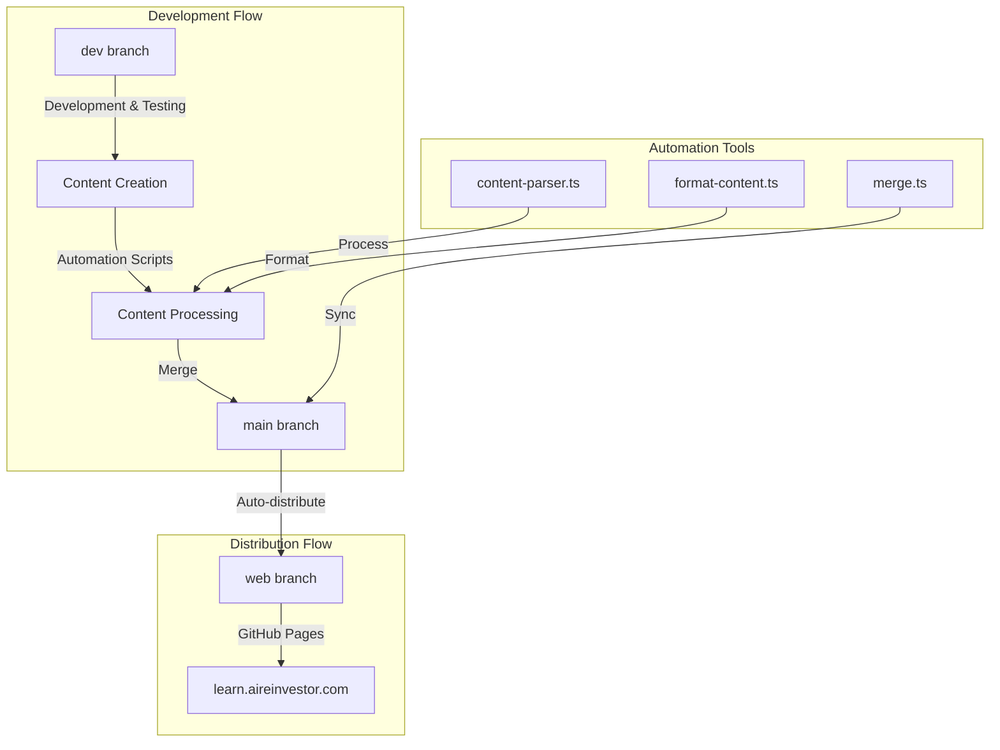

# AI REI Teachings - Open Source Project

## 👋 Welcome to Our Community!

This repository is a public version of a larger project focused on AI automation, development education, and business transformation. We're looking for passionate contributors who want to learn, grow, and help shape the future of AI-powered development.

## 🎯 Why Contribute?

We're building a platform that:
- Educates developers and businesses about AI automation
- Creates opportunities for developers in an AI-driven future
- Provides real-world solutions for business operations
- Empowers companies to leverage AI effectively

## 🛠️ Areas Where We Need Help

- Project Organization & Maintenance
- Quality Assurance
- Recruitment & Community Building
- Ideation & Innovation
- CI/CD Implementation
- Security Best Practices

-- IF YOU WANT TO HELP REACH OUT --[OUR DISCORD SERVER](https://discord.com/channels/1356944582423613520/1356944583233372252)


## 💡 Our Vision

We're creating a comprehensive platform that includes:

1. **AI-Powered Blogging Platform** (freeblog.aireinvestor.com)
   - Automated content generation
   - Custom AI personas
   - Integration with various data sources

2. **Business Consulting Services** (aireinvestor.com)
   - AI implementation consulting
   - Development operations optimization
   - Custom automation solutions

3. **Educational Resources**
   - AI development tutorials
   - Best practices documentation
   - Real-world use cases

## 🚀 Technical Stack

- Next.js 15 with React 19
- Appwrite for user authentication
- OpenRouter for flexible AI model integration
- Custom Go backend for automation
- Fabric CLI tools for AI prompting

## 🤝 How to Get Involved

1. Join our Discord community
2. Contribute to this public repository
3. Schedule a call to discuss potential collaboration

## 📈 Growth & Impact

We're committed to:
- Creating sustainable revenue streams
- Supporting charitable causes
- Building a community of AI-savvy developers
- Transforming business operations through AI

## 📞 Let's Connect

Visit [aireinvestor.com](https://aireinvestor.com) to:
- Schedule a consultation
- Learn more about our services
- Join our growing community  [OUR DISCORD SERVER](https://discord.com/channels/1356944582423613520/1356944583233372252)

---

*Note: This is a work in progress, and we welcome your feedback and contributions to help shape the future of AI-powered development.*

## Repository Structure
- **web branch**: Public branch containing the live website content
  - Hosted at [learn.aireinvestor.com](https://learn.aireinvestor.com)
  - Contains only public-facing content
  - Will be auto-populated from private repo
  - Managed through GitHub Pages
- **main branch**: Private development branch
  - Contains development tools and internal content
  - Used for development and automation
  - Will be linked to private repo ([AIrie-teachings-dev](https://github.com/THE-AI-REAL-ESTATE-INVESTOR/AIrie-teachings-dev)) - [freeblog.aireinvestor.com](https://freeblog.aireinvestor.com)
- **PENDING/Wisdom**: Documentation and reference materials for internal use
- **docs/**: Website files for GitHub Pages
  - **CNAME**: Custom domain configuration
  - **index.html**: Main entry point for the website
  - **learn/**: Learning resources and tutorials
    - Markdown files for easy content management
    - Automatically rendered by GitHub Pages
    - Organized by topic and difficulty level
- **utils/**: Development tools and automation scripts
  - Contains development-only tools
  - Includes merge automation scripts
  - Development utilities

## Branch Workflow


```mermaid
graph TD
    subgraph Development[Development Flow]
        A1[dev branch] -->|Development & Testing| A2[Content Creation]
        A2 -->|Automation Scripts| A3[Content Processing]
        A3 -->|Merge| B1
    end

    subgraph Distribution[Distribution Flow]
        B1[main branch] -->|Auto-distribute| B2[web branch]
        B2 -->|GitHub Pages| B3[learn.aireinvestor.com]
    end

    subgraph Automation[Automation Tools]
        C1[content-parser.ts] -->|Process| A3
        C2[merge.ts] -->|Sync| B1
        C3[format-content.ts] -->|Format| A3
    end
```

### Branch Structure

1. **dev branch** (Development)
   - Where all development happens
   - Content creation and editing
   - Testing automation scripts
   - Running content processors

2. **main branch** (Distribution)
   - Receives processed content from dev
   - Acts as distribution point
   - Automatically pushes to web branch
   - No direct editing here

3. **web branch** (Public)
   - Public-facing content only
   - Hosted on GitHub Pages
   - Automatically updated from main
   - No direct editing

### Workflow Steps

1. **Development** (dev branch):
   - Create/edit content in `docs/`
   - Run automation scripts
   - Test changes locally
   - Commit changes

2. **Distribution** (main branch):
   - Merge approved changes from dev
   - Automation scripts run
   - Content is processed and validated
   - Ready for public distribution

3. **Publication** (web branch):
   - Receives processed content from main
   - GitHub Pages deploys to learn.aireinvestor.com
   - Public can view changes

### Automation Tools Location

```
src/
├── scripts/
│   ├── content-parser.ts     # Process content
│   ├── merge.ts             # Handle branch merging
│   ├── format-content.ts    # Format content
│   └── fixers/             # Content fix utilities
└── config/
    └── site.config.ts      # Site configuration

.portfolio/                  # Separate portfolio tools
└── scripts/
    └── portfolio-pusher.ts # Portfolio-specific automation
```

## Development Workflow

### Branch Structure
```mermaid
graph TD
    subgraph Private[Private Development - AIrie-teachings-dev]
        A1[Development Tools]
        A2[Internal Docs]
        A3[Automation Scripts]
    end

    subgraph Public[Public Website - AI-REI-TEACHINGS]  
        B1[Public Content] -->|learn.aireinvestor.com| B4[Lead Magnet]
        B2[Learning Resources] -->|/learn| B4
        B3[Website Files] -->|GitHub Pages| B4
    end

    subgraph External[External Integration]
        C1[freeblog.aireinvestor.com]
        C2[AI & Automation]
    end

    A1 -->|Development| C1
    A2 -->|Reference| C1
    A3 -->|Automation| C1
    C1 -->|Auto-Populate| B1
    C1 -->|Auto-Populate| B2
    C1 -->|Auto-Populate| B3
```

### Content Flow

1. **Development**:
   - All development happens in the `main` branch
   - Development tools stay in `main` branch
   - Content is organized in `docs/` directory

2. **Deployment**:
   - Content is merged from `main` to `web`
   - Development tools are excluded via `.gitignore`
   - Web branch contains only public content

3. **Automation**:
   - Private repo ([AIrie-teachings-dev](https://github.com/THE-AI-REAL-ESTATE-INVESTOR/AIrie-teachings-dev)) handles content generation
   - AI & Automation tools manage content updates
   - Auto-populates the public web branch
-  join-discord to connect! or set up a call with me [aireinvestor.com](https://aireinvestor.com)