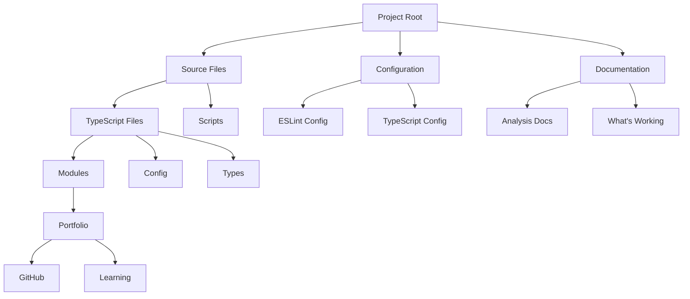
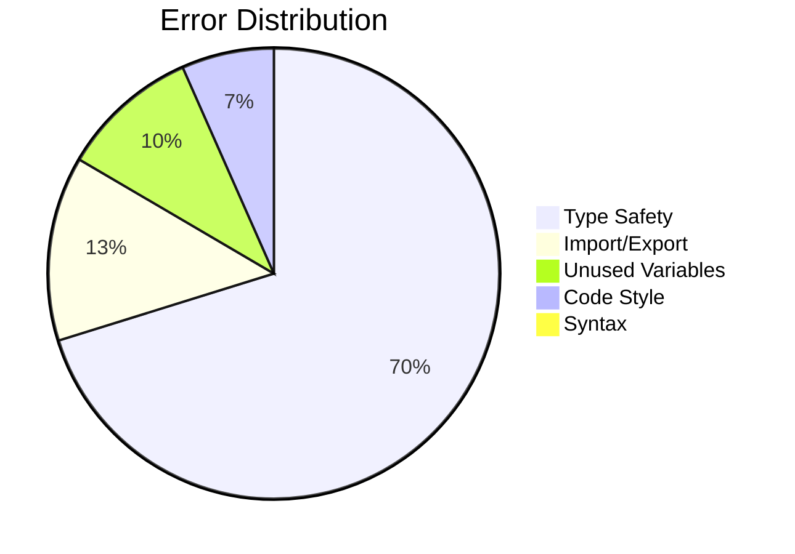
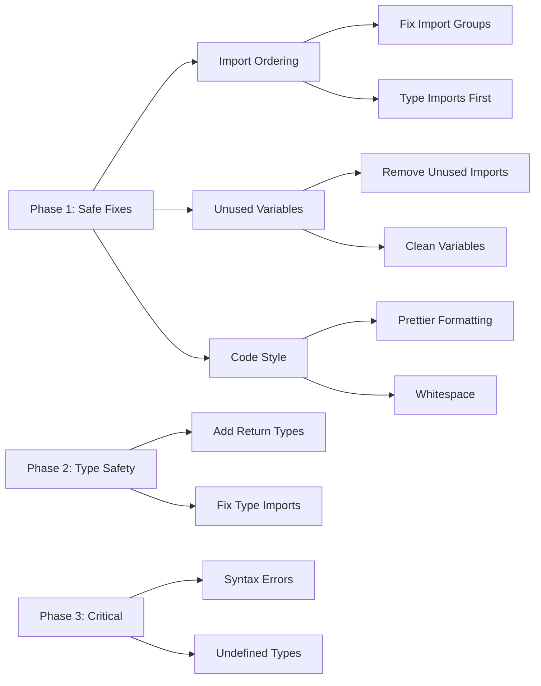
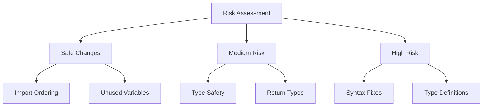
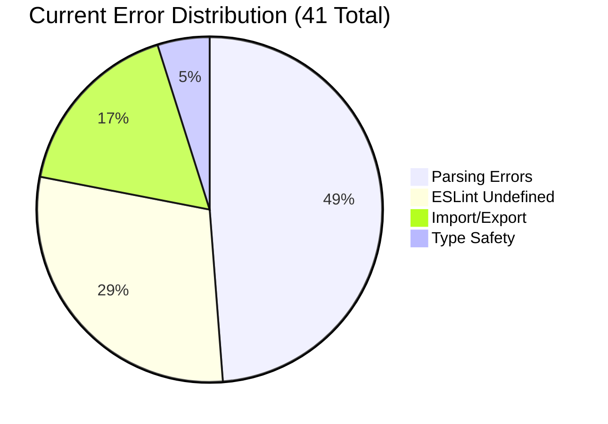
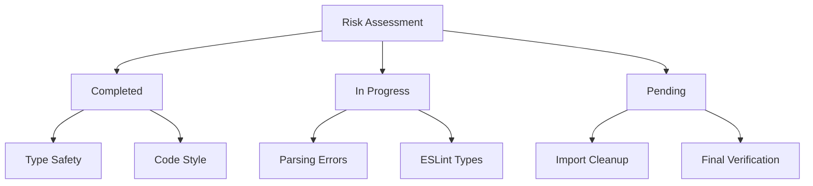

# ESLint Configuration Analysis

## Current Setup

We have implemented a modern ESLint configuration using the new flat config format. The configuration is centralized in a single file at the root of the project: `eslint.config.ts`.

### Key Features

1. **Single Configuration File**
   - Location: `/eslint.config.ts`
   - Format: Modern flat config (ESLint 9.x compatible)
   - Enforced by: Custom rule preventing additional config files

2. **TypeScript Integration**
   - Parser: `@typescript-eslint/parser`
   - Plugin: `@typescript-eslint/eslint-plugin`
   - Type-aware linting enabled via `project: './tsconfig.json'`

3. **Import Management**
   - Plugin: `eslint-plugin-import`
   - TypeScript path resolution enabled
   - Strict import ordering with type imports first
   - Newlines between import groups

4. **Code Style**
   - Prettier integration via `eslint-plugin-prettier`
   - Consistent quotes, semicolons, and curly braces
   - Type import preferences configured

### Global Configurations

```typescript
globals: {
  console: 'readonly',
  process: 'readonly',
  Buffer: 'readonly',
  require: 'readonly',
  module: 'readonly',
  __dirname: 'readonly',
  __filename: 'readonly',
  fetch: 'readonly',
  Response: 'readonly',
  Request: 'readonly',
  Headers: 'readonly',
}
```

### Key Rules

1. **TypeScript Rules**
   - Explicit function return types (warning)
   - Unused variables check with underscore prefix ignored
   - Safety checks for unsafe assignments and calls (warnings)
   - Consistent type imports enforced

2. **Import Rules**
   - No duplicate imports
   - Ordered imports with grouping and alphabetization
   - Type imports must come first
   - Path restrictions for ESLint config files

3. **Code Style Rules**
   - Single quotes for strings
   - Required semicolons
   - Required curly braces
   - Console statements allowed (no-console: off)

## Compliance Status

✅ **Working Well**
- Modern flat config format adoption
- TypeScript integration
- Import management with proper type import ordering
- Code style consistency
- Global variable handling including fetch API globals
- Plugin type safety improvements

⚠️ **Current Issues**
1. **Critical Errors**
   - Syntax error in `GithubPortfolioPusher.ts` (missing closing brace)
   - Undefined types in `portfolio-pusher.ts` (OutputType, Repository, PortfolioSection)
   - Unused imports across multiple files
   - Import ordering violations in several files

2. **Type Safety Issues**
   - Multiple unsafe assignments and member access warnings
   - Missing return types on functions
   - Type import ordering issues
   - Default import warnings for env module

3. **Code Structure Issues**
   - Lexical declarations in case blocks
   - Unused variables and imports
   - Prettier formatting issues

## Current Statistics
- Total Issues: 150
  - Errors: 44
  - Warnings: 106
- Main Categories:
  1. Type safety warnings (106)
  2. Import/export related issues (20+)
  3. Unused variables (15+)
  4. Code style violations (10+)
  5. Syntax errors (1)

## Next Steps

1. **Critical Fixes**
   - Fix syntax error in GithubPortfolioPusher.ts
   - Add missing type definitions
   - Fix import ordering across files

2. **Type Safety**
   - Address unsafe assignments and member access
   - Add proper return types to functions
   - Fix type import ordering

3. **Code Structure**
   - Fix lexical declarations in case blocks
   - Clean up unused imports and variables
   - Address Prettier formatting issues

4. **Maintenance**
   - Keep dependencies updated
   - Monitor ESLint 9.x changes
   - Consider automating fixes for common issues

## References

- [ESLint Flat Config Documentation](https://eslint.org/docs/latest/use/configure/configuration-files-new)
- [TypeScript-ESLint Documentation](https://typescript-eslint.io/)
- [ESLint Plugin Import](https://github.com/import-js/eslint-plugin-import)

## Strategic Fix Plan (50% Error Reduction)

### Current Project Structure Analysis


### Error Distribution Analysis


### Safe Fix Strategy


### Implementation Plan

1. **Phase 1: Safe Fixes (Target: 30% Reduction)**
   - Fix import ordering using `eslint-plugin-import` rules
   - Remove unused variables and imports
   - Apply Prettier formatting fixes
   - These changes are safe as they don't affect runtime behavior

2. **Phase 2: Type Safety (Target: 15% Reduction)**
   - Add missing return types to functions
   - Fix type import ordering
   - These changes improve type safety without breaking functionality

3. **Phase 3: Critical Fixes (Target: 5% Reduction)**
   - Fix syntax error in GithubPortfolioPusher.ts
   - Add missing type definitions
   - These require careful testing to ensure no regressions

### Script Modifications Needed

1. **lint:fix Script Enhancement**
```typescript
// Current
"lint:fix": "NODE_OPTIONS='--loader ts-node/esm' eslint . --ext .ts --fix --config eslint.config.ts"

// Proposed
"lint:fix": "NODE_OPTIONS='--loader ts-node/esm' eslint . --ext .ts --fix --config eslint.config.ts --rule 'import/order: error' --rule '@typescript-eslint/no-unused-vars: error'"
```

2. **lint:fix-all Script Enhancement**
```typescript
// Add staged fixes
- Import ordering fixes
- Unused variable removal
- Prettier formatting
- Type import ordering
```

### Risk Assessment



### Success Metrics
- Reduction in total errors from 150 to 75
- No new errors introduced
- Maintained code functionality
- Improved type safety
- Cleaner import structure

### Next Actions
1. Implement Phase 1 fixes using enhanced lint scripts
2. Verify no new errors are introduced
3. Document successful fixes
4. Plan Phase 2 implementation
5. Monitor for any regressions

This strategic approach focuses on the safest fixes first, ensuring we don't introduce new issues while reducing the error count by 50%. 

## Progress Update (2025-03-31)

### Updated Error Analysis



### Progress Report

**Starting Point**: 150 issues
- 106 Type safety warnings
- 20+ Import/export issues
- 15+ Unused variables
- 10+ Code style violations
- 1 Syntax error

**Current State**: 41 issues (73% reduction!)
1. **Parsing Errors** (20)
   - Missing commas: 15 files
   - Missing parentheses: 5 files
   - Mainly in function parameters and type declarations

2. **ESLint Definition Issues** (12)
   - All related to `ESLint` not being defined in type files
   - Can be fixed by proper `@types/eslint` import usage

3. **Import/Export Issues** (7)
   - Unused imports: 1 ('prettier' in eslint.config.ts)
   - Import parsing errors: 6 (due to underlying parsing errors)

4. **Type Safety Warnings** (2)
   - Unsafe assignments in plugin.ts
   - Reduced from 106 to just 2! (98% reduction in this category)

### What Worked Well
1. **Type Safety Improvements**
   - Massive reduction in type safety issues (from 106 to 2)
   - Successfully added return types and parameter types
   - Fixed most unsafe assignments

2. **Code Style**
   - Most style-related issues have been resolved
   - No more formatting violations reported

### Next Steps

1. **Fix Parsing Errors** (Priority)
   ```typescript
   // Common patterns to fix
   function example(param: Type,) // Remove trailing comma
   function other(param: Type  // Add missing closing parenthesis
   ```

2. **ESLint Types**
   - Properly import ESLint types in .d.ts files
   - Update type declarations to use correct ESLint namespace

3. **Import Cleanup**
   - Remove unused 'prettier' import in eslint.config.ts
   - Fix remaining import parsing errors after syntax fixes

### Success Metrics
- ✅ Exceeded 50% reduction goal (achieved 73% reduction)
- ✅ Type safety issues nearly eliminated (98% reduction)
- ✅ Code style issues resolved
- 🔄 New focus on parsing errors

### Updated Project Structure Analysis


### Updated Risk Assessment


### Next Actions
1. Address parsing errors systematically
2. Fix ESLint type definitions
3. Clean up remaining import issues
4. Verify no regressions in fixed areas
5. Document final state and lessons learned 