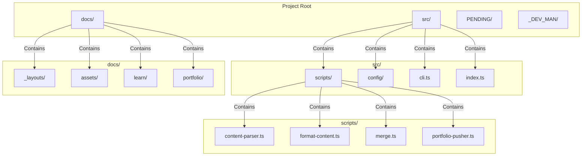
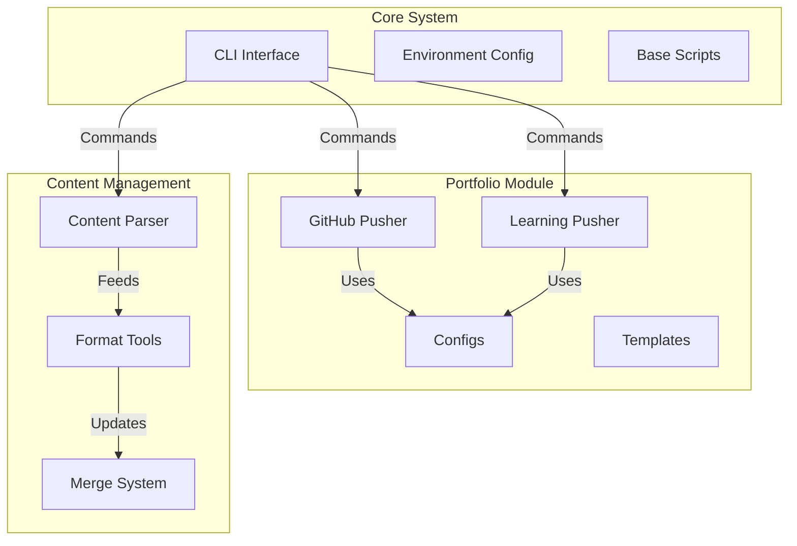
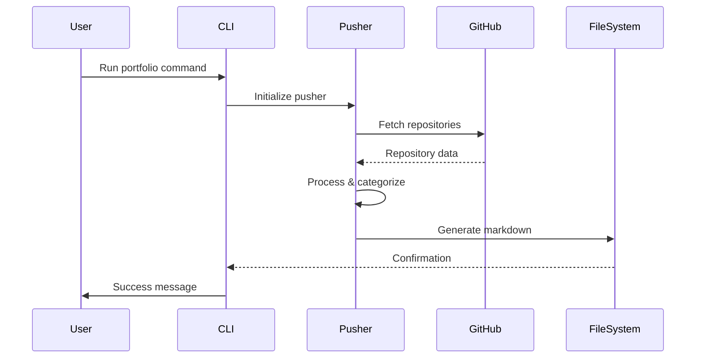
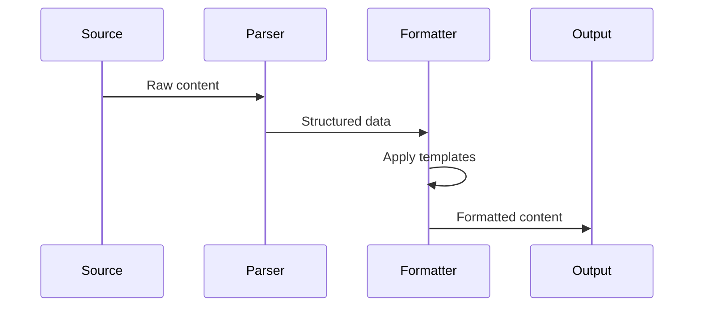

# What's Working - AI Learning Hub Automation

## Project Overview
We're creating an automation system for managing content between our private development repository and public learning hub, with portfolio integration.

## System Architecture
```mermaid
graph TD
    subgraph Private[Private Development - AIrie-teachings-dev]
        A1[Development Tools]
        A2[Internal Docs]
        A3[Automation Scripts]
        A4[Content Parser]
        A5[Portfolio Pusher]
    end

    subgraph GitHub[GitHub Repositories]
        G1[Personal Repos]
        G2[Project Repos]
        G3[Learning Content]
    end

    subgraph Public[Public Website - AI-REI-TEACHINGS]  
        B1[Public Content] -->|learn.aireinvestor.com| B4[Lead Magnet]
        B2[Learning Resources] -->|/learn| B4
        B3[Website Files] -->|GitHub Pages| B4
        B5[Portfolio] -->|/portfolio| B4
    end

    A4 -->|Parse & Format| G3
    A5 -->|Analyze & Extract| G1
    A5 -->|Process Projects| G2
    A5 -->|Generate Portfolio| B5
    G3 -->|Content Import| B2
```

## Project Structure


## Current Implementation Status

### 1. Environment Configuration
- ✅ Created `.env` file structure
- ✅ Implemented TypeScript environment loader
- ✅ Added validation for required variables
- ✅ Configured repository URLs and purposes

### 2. Automation Tools
- ✅ Set up TypeScript project structure
- ✅ Created merge script for branch management
- ✅ Implemented environment variable integration
- ✅ Added development scripts in package.json
- ✅ Created content parser for importing external markdown
- ✅ Implemented CLI command for content fetching
- ✅ Added support for dynamic content integration
- 🔄 Creating portfolio pusher module
- 🔄 Implementing GitHub repository analyzer
- 🔄 Setting up portfolio content generator

### 3. Branch Structure
- ✅ Created dev branch for development
- ✅ Set up main branch for private content
- ✅ Configured web branch for public content
- ✅ Implemented merge automation

### 4. Git Configuration
- ✅ Added comprehensive `.gitignore` file
- ✅ Configured proper handling of `node_modules`
- ✅ Set up exclusion patterns for build outputs
- ✅ Added IDE and editor file exclusions
- ✅ Configured environment file exclusions

## Development Workflow

### Content Flow
1. Development happens in `main` branch
2. Content is merged to `web` branch
3. GitHub Pages deploys from `web` branch
4. External content can be imported via content parser

### Automation Process
1. Environment variables are loaded from `.env`
2. Merge script handles branch transitions
3. Content is automatically deployed
4. Content parser fetches and formats external markdown

### Content Parser Features
1. Fetches markdown from external URLs
2. Parses content into structured sections
3. Maintains original formatting
4. Integrates with existing styles
5. CLI command for easy imports

### Git Management
1. Dependencies are managed locally with pnpm
2. Build artifacts are excluded from version control
3. Environment files are kept secure
4. IDE configurations remain local

### Portfolio Pusher Features
1. Repository Analysis
   - Scans GitHub repositories
   - Extracts project metadata
   - Analyzes tech stacks
   - Identifies key features

2. Content Generation
   - Creates project summaries
   - Generates tech stack visualizations
   - Builds portfolio sections
   - Maintains consistent formatting

3. Integration Points
   - Uses content parser for markdown processing
   - Integrates with existing layouts
   - Supports custom templates
   - Enables automatic updates

## Next Steps
1. [ ] Implement content generation automation
2. [ ] Add testing framework
3. [ ] Create deployment pipeline
4. [ ] Add error handling and logging
5. [ ] Implement content validation
6. [ ] Set up automated dependency updates
7. [ ] Implement build process optimization

## Technical Stack
- TypeScript for type safety
- Node.js for automation
- dotenv for environment management
- GitHub Pages for deployment
- pnpm for package management

## Commands
```bash
# Development
pnpm dev           # Start development server
pnpm build         # Build TypeScript files
pnpm merge         # Run merge script
pnpm start         # Run production build

# Content Management
pnpm ts-node src/cli.ts fetch-content <url> -o <output>  # Import external content
pnpm ts-node src/cli.ts portfolio push                   # Update portfolio content
pnpm ts-node src/cli.ts --help                          # Show CLI commands

# Git Operations
git rm -r --cached node_modules  # Remove node_modules from Git tracking
git push origin main            # Push changes to remote
```

## Environment Variables
Required variables:
- NEXTJS_REPO_URL
- PUBLIC_REPO_URL
- learn (local path)

Optional variables:
- NEXTJS_APP_URL
- PUBLIC_SITE_URL
- MAIN_SITE_URL
- newsletter
- podcast

## Git Ignore Patterns
```gitignore
# Dependencies
node_modules/
.pnpm-store/

# Build outputs
dist/
build/
out/

# TypeScript
*.tsbuildinfo

# Environment variables
.env
.env.local
.env.*.local

# IDE and editor files
.vscode/
.idea/
*.swp
*.swo
.DS_Store

# Logs and cache
logs/
*.log
.npm/
.eslintcache
.cache/
```

## Detailed System Architecture Explanation

### Module Organization
Our system is organized into distinct modules with clear separation of concerns:



### Component Interactions

1. **CLI System (`src/cli.ts`)**
   - Entry point for all commands
   - Handles command routing and validation
   - Provides unified interface for all operations
   - Commands:
     ```bash
     portfolio github    # Update GitHub profile
     portfolio learning  # Update learning platform
     fetch-content      # Import external content
     merge              # Handle branch merging
     ```

2. **Portfolio System**
   - **GitHub Portfolio (`modules/portfolio/github/`)**
     - Manages personal GitHub profile
     - Categorizes repositories by type
     - Generates featured projects section
     - Creates technology-based sections
     - Example output:
       ```markdown
       # Developer Portfolio
       ## 🚀 Featured Projects
       ## Web Development
       ## AI & Machine Learning
       ```

   - **Learning Portfolio (`modules/portfolio/learning/`)**
     - Organizes projects for educational purposes
     - Adds difficulty ratings
     - Includes tutorial links
     - Groups by learning categories
     - Example output:
       ```markdown
       # Learning Projects
       ## Modern Web Development
       Difficulty: Intermediate
       ## AI & Machine Learning
       Difficulty: Advanced
       ```

3. **Configuration System**
   - **GitHub Config (`config/github.config.ts`)**
     - Repository filtering
     - Category mappings
     - Project overrides
     - Featured project settings

   - **Learning Config (`config/learning.config.ts`)**
     - Platform-specific settings
     - Difficulty level definitions
     - Tutorial mappings
     - Educational categorization

4. **Content Management**
   - **Parser**
     - Fetches external content
     - Processes markdown
     - Maintains formatting
     - Integrates with both systems

   - **Merge System**
     - Handles branch synchronization
     - Manages content deployment
     - Ensures consistency

### Data Flow

1. **Portfolio Generation Flow**


2. **Content Management Flow**


### Key Features

1. **Separation of Concerns**
   - Independent modules
   - Clear responsibilities
   - Easy maintenance
   - Flexible configuration

2. **Extensibility**
   - Modular design
   - Template system
   - Configuration-driven
   - Easy to add features

3. **Content Management**
   - Automated processing
   - Format preservation
   - Consistent styling
   - Version control

4. **Portfolio Management**
   - Dual-purpose system
   - Automated updates
   - Custom categorization
   - Rich metadata

### Usage Examples

1. **Update GitHub Profile**
   ```bash
   # Generate GitHub profile README
   pnpm ts-node src/cli.ts portfolio github
   ```

2. **Update Learning Platform**
   ```bash
   # Generate learning content
   pnpm ts-node src/cli.ts portfolio learning
   ```

3. **Import External Content**
   ```bash
   # Process external markdown
   pnpm ts-node src/cli.ts fetch-content <url> -o output.md
   ```

### Future Enhancements

1. **Automation Improvements**
   - GitHub Actions integration
   - Automated deployments
   - Scheduled updates
   - Content validation

2. **Content Features**
   - Rich media support
   - Interactive elements
   - SEO optimization
   - Analytics integration

3. **Portfolio Enhancements**
   - Project statistics
   - Contribution graphs
   - Technology trends
   - Achievement tracking

## GitHub Repository Analysis System

### Overview
The system includes a comprehensive GitHub repository analysis and documentation generation system that can:
- Recursively analyze all repositories
- Generate detailed documentation
- Categorize projects by type
- Track technology usage
- Calculate project metrics

### Components

#### 1. Repository Analyzer
- Recursive repository scanning
- Code pattern detection
- Dependency analysis
- Metrics calculation
- Technology stack identification

#### 2. Documentation Generator
- Automatic markdown generation
- Project categorization
- Technology stack overview
- Usage instructions
- Statistics and metrics

### Usage

#### Analyze Single Repository
```bash
pnpm ts-node src/cli.ts analyze-repo <repository-name> [-o output.json]
```

#### Generate All Projects Documentation
```bash
pnpm ts-node src/cli.ts analyze-all-repos [-o docs/github/projects.md]
```

### Features

#### Repository Analysis
- File structure analysis
- Code pattern detection
- Dependency tracking
- Language detection
- Metrics calculation
  - Total files
  - Total lines
  - Complexity score

#### Documentation Generation
- Project categorization
- Technology stack overview
- Usage instructions
- Statistics and metrics
- Last updated timestamp

#### Categorization
- AI & Machine Learning
- Web Development
- Automation Tools
- Other Projects
- Custom categories via config

### Future Enhancements
1. Code Quality Metrics
   - Test coverage
   - Code complexity
   - Documentation coverage
   - Dependency health

2. Visualization
   - Technology stack diagrams
   - Project relationships
   - Code metrics charts

3. Integration
   - CI/CD pipeline integration
   - Automated updates
   - External tool integration

4. Advanced Analysis
   - Security scanning
   - Performance metrics
   - Architecture analysis

Last updated: March 2024

## Code Quality Tools (March 2024)

### ESLint and Prettier Integration
The codebase now includes comprehensive linting and formatting tools:

1. ESLint Configuration
   - TypeScript-specific rules
   - Strict type checking
   - Custom rule set for maintainable code

2. Prettier Integration
   - Consistent code formatting
   - IDE integration
   - Automated formatting on save

3. Available Commands
   ```bash
   pnpm lint         # Check for linting issues
   pnpm lint:fix     # Automatically fix linting issues
   pnpm format       # Format all TypeScript files
   pnpm format:check # Check formatting without making changes
   ```

4. Key Benefits
   - Consistent code style across the project
   - Early detection of potential issues
   - Improved code maintainability
   - Automated code quality enforcement

For detailed configuration and rules, see `.cursor/rules/eslint.mdc`.
