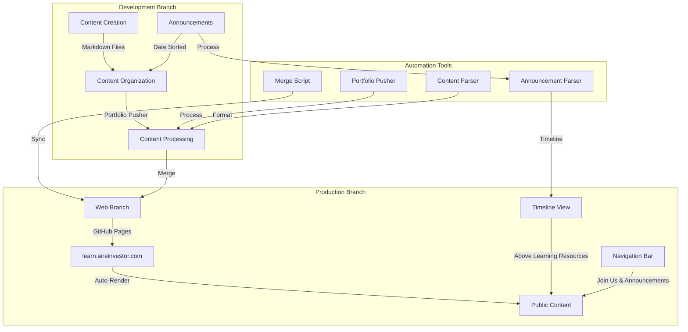

# Content Workflow Documentation

## Overview

This document explains how content flows from development to production in our repository. The workflow is designed to maintain separation between development and production content while ensuring proper deployment.

## Content Flow Diagram

## Workflow Steps

1. **Content Creation**
   - Content is created in markdown files in the development branch
   - Files are organized in appropriate directories (e.g., `docs/`, `PENDING/`)
   - Example: `discussion-announcement.md` → `docs/join-us.md`

2. **Content Processing**
   - The Portfolio Pusher script processes content
   - Content Parser formats and validates markdown
   - Files are prepared for deployment

3. **Deployment**
   - Merge script moves content from development to web branch
   - GitHub Pages automatically renders markdown to HTML
   - Content becomes available at learn.aireinvestor.com

## Announcements Workflow

1. **Announcement Creation**
   - Create markdown files in `/announcements` directory
   - Required metadata:
     - Date (YYYY-MM-DD format)
     - Author (default: "airienvestor - Mark Carpenter")
     - Title
     - Category (optional)

2. **Timeline Processing**
   - Announcements are automatically sorted by date
   - Rendered in a timeline view above Learning Resources
   - Each announcement links to its full content page
   - Latest announcements appear first

3. **Navigation Integration**
   - "Join Us" and "Announcements" added to main navigation
   - Timeline view on homepage
   - Individual announcement pages at `/announcements/{slug}`
   - Join Us page at `/join-us`

## File Locations

- **Development Files**: 
  - `src/` - Development tools and scripts
  - `PENDING/` - Work in progress content
  - `docs/` - Production-ready content
  - `announcements/` - Announcement markdown files

- **Production Files**:
  - `web` branch - Public-facing content
  - `learn.aireinvestor.com` - Live website

## Automation Tools

1. **Merge Script** (`src/scripts/merge.ts`)
   - Handles merging from development to web branch
   - Ensures proper branch switching
   - Manages git operations

2. **Portfolio Pusher** (`src/scripts/portfolio-pusher.ts`)
   - Processes repository content
   - Categorizes and formats content
   - Handles GitHub API interactions

3. **Content Parser** (`src/scripts/content-parser.ts`)
   - Validates markdown content
   - Ensures proper formatting
   - Handles content transformations

4. **Announcement Parser**
   - Processes announcement markdown files
   - Sorts by date
   - Generates timeline view
   - Updates navigation

## Best Practices

1. **Content Organization**
   - Keep development files in appropriate directories
   - Use clear, descriptive filenames
   - Follow markdown formatting guidelines

2. **Deployment Process**
   - Always test content locally first
   - Use the merge script for deployment
   - Verify content on learn.aireinvestor.com

3. **Version Control**
   - Keep development and production branches separate
   - Use meaningful commit messages
   - Follow the established workflow

4. **Announcements**
   - Always include required metadata
   - Use consistent date format
   - Keep announcements concise for timeline view
   - Link to full content when needed

## Troubleshooting

If content doesn't appear as expected:
1. Check the merge script output
2. Verify file locations in web branch
3. Check GitHub Pages build logs
4. Ensure proper markdown formatting
5. Verify announcement metadata format 